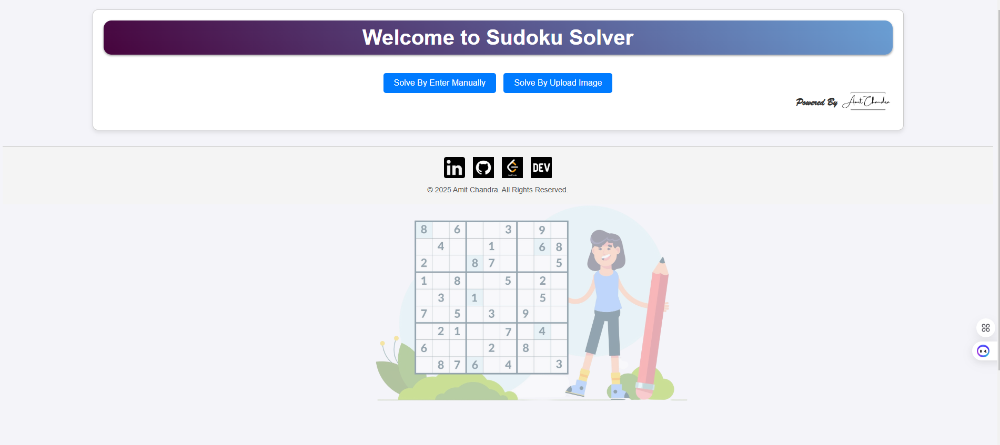
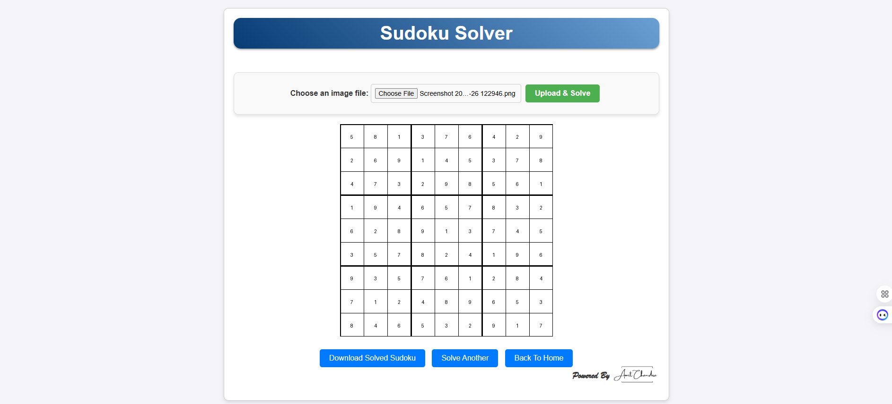

# Sudoku Solver

A web-based Sudoku solver built with Flask, designed to solve Sudoku puzzles from uploaded images or manual input. This application uses a trained machine learning model (scikit-learn) to assist in solving puzzles and employs computer vision techniques to extract Sudoku grids.

---

## 🌍 Live Demo

🔗 [Sudoku Solver - Live on Render](https://sudoku-solver-fv8o.onrender.com/)

## 🚀 Features

- **Image Upload**: Upload an image of a Sudoku puzzle, and the application will extract and solve it using a trained model.
- **Manual Input**: Enter the Sudoku puzzle directly using an interactive grid.
- **Machine Learning Integration**: Utilizes a scikit-learn model for better accuracy in digit recognition and puzzle solving.
- **Dynamic Solutions**: Displays the solved Sudoku puzzle with an option to download the result.
- **Beautiful UI**: Includes visually appealing faded background Sudoku grids for a polished look.
- **Error Handling**: Provides meaningful error messages for invalid inputs or unsolvable puzzles.

---

## 🛠️ Tech Stack

- **Backend**: Flask (Python)
- **Frontend**: HTML, CSS, JavaScript
- **Computer Vision**: OpenCV, NumPy
- **Machine Learning**: scikit-learn (digit recognition model)
- **Sudoku Solver**: Custom backtracking algorithm
- **Others**: PIL (Pillow), Flask-Caching

---

## 🎯 How It Works

1. **Image Processing**: Uploaded Sudoku images are processed using OpenCV.
2. **Digit Recognition**: A scikit-learn model is used to detect numbers from the extracted grid.
3. **Puzzle Solving**: The recognized numbers are used as input for a backtracking-based Sudoku solver.
4. **User Interaction**: Users can upload images or manually enter Sudoku puzzles for instant solutions.

## 🔍 SEO Tags

`sudoku solver`, `AI sudoku solver`, `Flask sudoku solver`, `machine learning sudoku solver`, `Sudoku image recognition`, `computer vision sudoku solver`, `Flask AI projects`, `Python sudoku solver`

---

## 🔗 Connect with Me
- **Dev**: [Connect With Me On Dev](https://dev.to/amitchandra/)
- **LinkedIn**: [Connect With Me On LinkedIn](https://www.linkedin.com/in/connect-amit-chandra/)
- **Twitter**: [Connect With Me On X](https://x.com/CodeByAmit)

---

## 📷 Screenshots

### Home Screen

### Solving an Uploaded Puzzle

